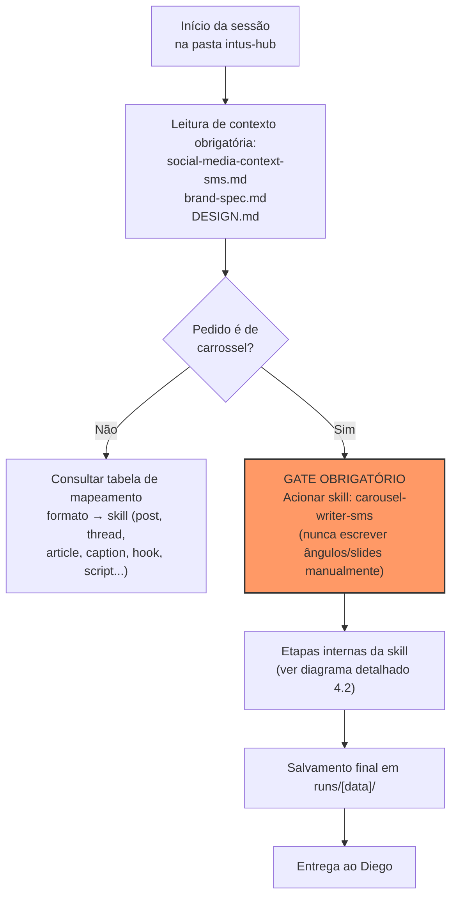

# PRD — Fluxo de Gates e Processo de Criação de Carrossel (Intus Hub / Master Design System)

**Versão:** 1.0
**Data:** 2026-07-27
**Autor:** Claude Code (a pedido de Diego Spanevello)
**Status:** `[DEFINIDO]` — reflete regras já vigentes em `CLAUDE.md` (raiz) e `CLAUDE.md` (Intus Hub)

---

## 1. Visão Geral (TL;DR)

Este PRD documenta — não cria — o processo obrigatório que qualquer sessão de produção de carrossel do Intus Hub deve seguir dentro do Master Design System: leitura de contexto de marca, gate de skill de criação (`carousel-writer-sms`), oferta de framework narrativo, pesquisa de contexto, QA de copy, tratamento de imagem/capa via JSON por zonas, e salvamento padronizado do artefato. O objetivo é tornar o fluxo visível e auditável, para que nenhuma etapa seja pulada — o que já aconteceu uma vez (incidente de 2026-07-21) e motivou a criação da regra.

---

## 2. O Problema

Em **2026-07-21**, um carrossel do Intus Hub foi produzido escrevendo ângulos manualmente em um arquivo solto (`angulos-[tema].md`), sem passar pela skill `carousel-writer-sms`. Isso pulou:
- **Etapa 0** — oferta do `narrative-framework-sms` (5 frameworks disponíveis: Value-Stack, Problem-Proof, Hack List, Rant Callout, Demo Walkthrough)
- **Fase 0.5** — pesquisa de contexto estruturada
- Os demais gates internos da skill de criação
- O gate de qualidade `copy-qa-sms` (Voice Gate + AI Pattern Gate + padrões estruturais)

**Causa raiz:** a convenção de nomenclatura de artefatos (definida no `CLAUDE.md` do cliente) especifica *onde salvar o resultado*, mas não é, por si só, o processo — e foi confundida como suficiente. Sem um documento visual do fluxo completo, é fácil pular etapas quando não há um artefato único e explícito descrevendo a sequência ponta a ponta.

**Impacto:** copy fora da voz do cliente, sem validação estrutural, sem passar por controle de qualidade — risco direto de peça publicada abaixo do padrão esperado pelo cliente.

---

## 3. Personas & Usuários

| Persona | Papel no fluxo |
|---|---|
| **Diego Spanevello** | Cliente/dono da conta Intus Hub — aprova o produto final |
| **Claude Code (operador do sistema)** | Executa o fluxo, aciona as skills, garante que nenhum gate seja pulado |
| **Skills de criação** (`carousel-writer-sms`, `narrative-framework-sms`, `copy-qa-sms`, `json-prompt-generator`) | Componentes do processo, cada uma responsável por uma etapa específica |

---

## 4. Solução Proposta

Formalizar o fluxo como um **workflow sequencial de 7 etapas**, com gates obrigatórios em cada ponto de decisão, e um diagrama que serve como checklist visual para qualquer sessão de criação de carrossel.

### 4.1 Diagrama de Fluxo — Visão Macro (Workflow)

### 4.2 Diagrama de Fluxo Detalhado — Processo Interno do `carousel-writer-sms`

Este diagrama reflete o conteúdo real e completo da skill (versão em `C:\Users\User\.claude\skills\carousel-writer-sms`), fase a fase.

```mermaid
flowchart TD
    S0["ETAPA 0 — Confirmação de\ncliente e tom\n(primeiro passo, sem exceção)"] --> S0a{"Cliente já\ndeclarado?"}
    S0a -- "Não" --> S0b["Perguntar qual cliente\ne carregar\nsocial-media-context-sms.md"]
    S0b --> S0c
    S0a -- "Sim" --> S0c{"Oferecer\nnarrative-framework-sms?"}

    S0c -- "Sim" --> NFS["Acionar narrative-framework-sms\n(5 ângulos: Value-Stack, Problem-Proof,\nHack List, Rant Callout, Demo Walkthrough)\nUsuário escolhe framework"]
    NFS --> CTX
    S0c -- "Não / já tem ângulo" --> CTX["CONTEXT CHECK\nLer social-media-context-sms.md\nExtrair: pilar ativado, dor do\npúblico, tom dominante"]

    CTX --> CTXok{"Arquivo de\ncontexto existe?"}
    CTXok -- "Não" --> CTXgate["GATE — avisar ausência de contexto\nRecomendar social-media-context-sms\nPerguntar: continuar em modo genérico?"]
    CTXgate -- "Sim, genérico" --> F05
    CTXgate -- "Não" --> RUNCTX["Acionar social-media-context-sms\nantes de prosseguir"]
    RUNCTX --> F05
    CTXok -- "Sim" --> F05["FASE 0.5 — Pesquisa de contexto\n(interna, não exibida ao usuário)\n① dado surpreendente ② fato contrarian\n③ case real ④ equívoco comum\n⑤ ângulo de identidade"]

    F05 --> F1["FASE 1 — Propor 3 ÂNGULOS\n(cada um: 3 variações de gancho,\ntom, narrativa, formato, framework\nnarrativo sugerido: PAS/AIDA/BAB/STAR/SLAY)"]
    F1 --> G1{"GATE — Ângulo +\ngancho aprovados\npelo usuário?"}
    G1 -- "Não" --> F1
    G1 -- "Sim" --> F15["FASE 1.5 — Modelar arco de\nstorytelling: Abertura → Ponte →\nVirada → Resultado → CTA/Pergunta\n(rascunho, não copy final)"]

    F15 --> G15{"GATE — Storytelling\naprovado?"}
    G15 -- "Não" --> F15
    G15 -- "Sim" --> F2["FASE 2 — Gate de CTA\nEscolher objetivo: engajamento c/\ngatilho, comentário livre, salvar,\ncompartilhar, venda direta, seguir"]

    F2 --> G2{"GATE — Tipo(s)\nde CTA definido(s)?"}
    G2 -- "Não" --> F2
    G2 -- "Sim" --> F3["FASE 3 — Input Gathering\nPlataforma + nº de slides\n(tabela por tipo de conteúdo)"]

    F3 --> GT{"GATE — Template de\nslide do cliente\ndefinido?"}
    GT -- "Não" --> GT1["Listar templates disponíveis\nem clients/[cliente]/references/\naguardar escolha"]
    GT1 --> GT
    GT -- "Sim" --> F35{"Há imagem de\nreferência visual?"}

    F35 -- "Sim" --> TD["FASE 3.5 — Visual Teardown\nLayout/Grid, Tipografia, Paleta,\nDensidade, Mood"]
    TD --> ARCO
    F35 -- "Não" --> ARCO["Escrever ARCO DO CARROSSEL\nCover → Context → Body (1 ideia/slide)\n→ CTA final, seguindo framework\nnarrativo e formato escolhidos"]

    ARCO --> CHK1["CHECKLIST AUTO-REVISÃO\nBloco 1 — integridade de conteúdo\nBloco 2 — padrões proibidos gerais\n(travessão, clichês)"]
    CHK1 --> QA["Bloco 3 — GATE copy-qa-sms\nVoice Gate + AI Pattern Gate +\nPadrões Estruturais"]
    QA --> SCORE{"Score interno\n≥ 90/100?"}
    SCORE -- "Não" --> REWRITE["Reescrever slides reprovados\nautomaticamente, sem pedir confirmação"]
    REWRITE --> QA
    SCORE -- "Sim" --> F5["FASE 5 — CTAs + Legendas\n3 versões de CTA final +\n3 legendas (150–400 palavras),\npareadas ao(s) CTA(s) da Fase 2"]

    F5 --> F6{"Usuário confirma:\n'gerar JSONs'?"}
    F6 -- "Sim" --> REF{"Há referências de\nimagem enviadas\nna sessão?"}
    REF -- "Sim" --> JPG_A["json-prompt-generator MODE A\nsobre cada referência\n(extrai composição/luz/câmera)"]
    REF -- "Não" --> JPG_B["json-prompt-generator direto\ncom base na direção visual\nde cada slide + brand-spec.md"]
    JPG_A --> JPGOUT["1 JSON por slide\n(cena + safe_area do template +\nparâmetros técnicos do cliente)"]
    JPG_B --> JPGOUT
    JPGOUT --> SAVE["Salvar em runs/[AAAA-MM-DD]/\ncarrossel-[tema].md / capas-[tema].md\n/ json-capas-[tema].md"]
    F6 -- "Ainda não" --> SAVE_TXT["Salvar apenas script + CTAs\n+ legendas em runs/[AAAA-MM-DD]/"]

    SAVE --> END["Entrega final ao Diego"]
    SAVE_TXT --> END

    style S0 fill:#f96,stroke:#333,stroke-width:2px
    style G1 fill:#ffd166,stroke:#333,stroke-width:2px
    style G15 fill:#ffd166,stroke:#333,stroke-width:2px
    style G2 fill:#ffd166,stroke:#333,stroke-width:2px
    style GT fill:#ffd166,stroke:#333,stroke-width:2px
    style QA fill:#f96,stroke:#333,stroke-width:2px
    style SCORE fill:#f96,stroke:#333,stroke-width:2px
```

### 4.3 Descrição das Etapas (Visão Macro)

| # | Etapa | Responsável | Obrigatório? |
|---|---|---|---|
| 1 | Leitura de contexto de marca (voz, paleta, design) | Sessão Claude Code | `[DEFINIDO]` sim |
| 2 | Identificar formato pedido → mapear para skill correta | Claude Code | `[DEFINIDO]` sim |
| 3 | Acionar `carousel-writer-sms` (gate de skill de criação) | Skill | `[DEFINIDO]` sim — nunca escrever manualmente |
| 4 | Etapa 0 — confirmação de cliente/tom + oferta do `narrative-framework-sms` | Skill | `[DEFINIDO]` sim, primeiro passo sem exceção |
| 5 | Context Check — carregar `social-media-context-sms.md`, gate se ausente | Skill | `[DEFINIDO]` sim |
| 6 | Fase 0.5 — pesquisa de contexto estruturada (5 pontos) | Skill | `[DEFINIDO]` sim, interna |
| 7 | Fase 1 — 3 ângulos + gancho + framework narrativo (gate de aprovação) | Skill | `[DEFINIDO]` sim |
| 8 | Fase 1.5 — modelagem do arco de storytelling (gate de aprovação) | Skill | `[DEFINIDO]` sim |
| 9 | Fase 2 — gate de CTA (objetivo do carrossel) | Skill | `[DEFINIDO]` sim |
| 10 | Fase 3 — input gathering (plataforma, nº de slides, template do cliente) | Skill | `[DEFINIDO]` sim |
| 11 | Fase 3.5 — Visual Teardown (se houver imagem de referência) | Skill | Condicional |
| 12 | Escrita do Arco (Cover/Context/Body/CTA) seguindo framework e formato | Skill | `[DEFINIDO]` sim |
| 13 | Checklist de auto-revisão (Blocos 1 e 2) | Skill | `[DEFINIDO]` sim |
| 14 | `copy-qa-sms` (Bloco 3) + Score ≥ 90/100, senão reescreve automaticamente | Skill | `[DEFINIDO]` sim — se a skill não tiver, é falha da skill |
| 15 | Fase 5 — 3 CTAs + 3 legendas pareadas | Skill | `[DEFINIDO]` sim |
| 16 | Fase 6 — Handoff: `json-prompt-generator` (Mode A se houver referência) por slide | Skill / Claude Code | Condicional a "gerar JSONs" |
| 17 | Salvamento em `runs/[data]/` com nomenclatura padrão | Claude Code | `[DEFINIDO]` sim |

---

## 5. Requisitos Funcionais

- **RF1:** O sistema (Claude Code) deve acionar a ferramenta `Skill` com `carousel-writer-sms` sempre que o pedido for de carrossel, independente do cliente.
- **RF2:** A skill `carousel-writer-sms` deve decidir internamente se oferece `narrative-framework-sms` na Etapa 0 — essa decisão não é responsabilidade da sessão externa.
- **RF3:** Nenhum copy de carrossel pode ser entregue sem passar pelo `copy-qa-sms`.
- **RF4:** Se houver imagem de referência e o pedido envolver gerar prompt/JSON de imagem, o sistema deve perguntar antes de usar `json-prompt-generator` — nunca assumir.
- **RF5:** Capas definitivas (não testes de fonte) devem sempre gerar JSON completo por zonas (`header`/`image`/`content`/`footer`), nunca widget HTML.
- **RF6:** Todo artefato final deve ser salvo em `clients/intus-hub/runs/[AAAA-MM-DD]/`, seguindo a tabela de nomenclatura do `CLAUDE.md` do cliente.
- **RF7:** JSONs gerados devem ser colados por completo no chat, não apenas referenciados por caminho de arquivo.

---

## 6. Requisitos Não-Funcionais

- **Auditabilidade:** cada etapa do fluxo deve ser identificável no histórico da sessão (qual skill foi chamada, quando).
- **Consistência entre clientes:** o gate de skill de criação (RF1–RF3) vale para todos os clientes do Master Design System, não só Intus Hub — definido no `CLAUDE.md` raiz.
- **Sem duplicação de regra:** esta lógica não deve ser recriada nos `CLAUDE.md` de clientes individuais, para evitar divergência quando as skills forem atualizadas.

---

## 7. Fora de Escopo

- Este PRD não define o funcionamento interno de `carousel-writer-sms`, `narrative-framework-sms` ou `copy-qa-sms` — essas são caixas-pretas de processo, documentadas nas próprias skills.
- Não cobre o fluxo de outros formatos de copy (post, thread, artigo) — esses seguem a mesma lógica de gate, mapeados na tabela do `CLAUDE.md` raiz, mas não são detalhados aqui.
- Não cobre workflow de outros clientes do Master Design System.

---

## 8. Métricas de Sucesso

- **Zero ocorrências** de copy de carrossel produzido sem passar pela skill `carousel-writer-sms`, medido por auditoria do histórico de sessão.
- **100% dos carrosséis entregues** com marcação de que passaram pelo `copy-qa-sms` antes da entrega final.
- Caso alguma etapa seja pulada intencionalmente (modo rascunho rápido), a sessão deve exibir o aviso `[⚠️ COPY SEM GATE DA SKILL — não passou por narrative-framework-sms nem pelos QA Gates de copy-qa-sms]` — 100% das vezes que isso ocorrer.

---

## 9. Dependências & Riscos

| Item | Tipo | Detalhe |
|---|---|---|
| `carousel-writer-sms` | Dependência | Skill precisa estar disponível e atualizada com Etapa 0 + Fase 0.5 |
| `copy-qa-sms` | Dependência | Se a skill de criação não incluir esse gate internamente, é considerado bug da skill, não exceção válida |
| `json-prompt-generator` | Dependência condicional | Só entra em cena quando há imagem de referência |
| Risco: sessão pular etapa por pressa/instrução ambígua do usuário | Risco | Mitigado pelo aviso explícito `[⚠️ COPY SEM GATE...]` quando o modo manual é escolhido |
| Risco: divergência entre `CLAUDE.md` de clientes | Risco | Mitigado por manter a regra centralizada apenas no `CLAUDE.md` raiz |

---

## 10. Timeline

`[DEFINIDO]` — processo já vigente, sem rollout necessário. Este documento formaliza e visualiza uma regra já ativa desde a atualização do `CLAUDE.md` raiz (regra criada após o incidente de 2026-07-21).

---

## 11. Perguntas em Aberto

- `[EM ABERTO]` Deve haver um mecanismo automatizado (hook) que bloqueie a escrita de arquivos `angulos-*.md`/`carrossel-*.md` fora do fluxo da skill, ou o controle deve continuar sendo apenas por instrução em `CLAUDE.md`?
- `[EM ABERTO]` Vale a pena versionar este PRD conforme as skills (`carousel-writer-sms`, `copy-qa-sms`) evoluírem, ou tratá-lo como snapshot pontual?
